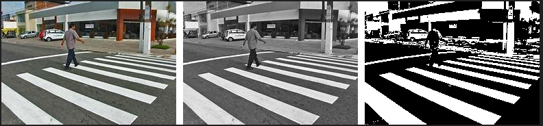

# Projeto de Conversão de Imagem para Tons de Cinza e Preto e Branco

Este projeto implementa a conversão de uma imagem para **tons de cinza** e **preto e branco** (binária), utilizando a biblioteca **Pillow** (Python Imaging Library). O processo envolve a manipulação dos pixels de uma imagem para gerar três versões dela: a original, a em tons de cinza e a em preto e branco. As imagens geradas são exibidas lado a lado, com contornos e espaçamento para facilitar a visualização.

## Objetivo

O objetivo deste projeto é demonstrar como é possível realizar operações de manipulação de imagens, como a conversão de cores, em Python usando a biblioteca **Pillow**. O projeto manipula os pixels de uma imagem para gerar versões em **tons de cinza** e **preto e branco**, exibindo-as em uma única imagem combinada.

## Funcionalidades

1. **Leitura de Imagem**: O código começa lendo uma imagem a partir do caminho fornecido.
2. **Conversão para Tons de Cinza**: A imagem é convertida para tons de cinza utilizando a fórmula de média ponderada dos componentes RGB.
3. **Conversão para Preto e Branco**: A imagem em tons de cinza é convertida para uma versão binária (preto e branco) utilizando um limiar de 128.
4. **Exibição das Imagens**: As imagens geradas são combinadas em uma única imagem, lado a lado, com espaçamento e contorno branco, para uma visualização mais clara.
5. **Espaçamento e Contorno**: A imagem final é exibida com um espaçamento configurável entre as versões e um contorno branco ao redor de cada uma.

## Dependências

Este projeto utiliza a biblioteca **Pillow** para manipulação de imagens. Para instalar, utilize o seguinte comando:

```bash
pip install Pillow
```
## Estrutura do Código

### Função `rgb_to_gray(r, g, b)`

Esta função converte os valores RGB de um pixel para um valor de escala de cinza, utilizando uma fórmula de média ponderada para considerar a percepção humana das cores. A fórmula utilizada é a seguinte:
```python
int(0.299 * r + 0.587 * g + 0.114 * b)
```
- **`r`**: Valor da componente vermelha.
- **`g`**: Valor da componente verde.
- **`b`**: Valor da componente azul.

Essa fórmula calcula um valor único que representa o grau de luminosidade do pixel, aproximando a percepção do olho humano. Ela é frequentemente utilizada para conversões de imagem para tons de cinza.

### Função `rgb_to_bw(gray_value, threshold=128)`

Esta função converte um valor de escala de cinza em uma imagem binária (preto e branco). O valor de cinza é comparado com um limiar (threshold), que por padrão é 128. Se o valor de cinza for maior que 128, o pixel se torna **branco (255)**; caso contrário, se o valor for menor ou igual a 128, o pixel se torna **preto (0)**.
```python
return 255 if gray_value > threshold else 0
```
- **`gray_value`**: O valor do pixel em tons de cinza.
- **`threshold`**: O limiar para decidir se o pixel será branco ou preto. O valor padrão é 128, mas ele pode ser ajustado.

### Fluxo do Código

1. **Carregamento da Imagem**: A imagem é carregada a partir do caminho especificado no início do código.
2. **Conversão para Tons de Cinza**: Para cada pixel da imagem original, o código chama a função `rgb_to_gray()`, convertendo os valores RGB para um único valor de escala de cinza. Este valor é armazenado na nova imagem em tons de cinza (`img_gray`).
3. **Conversão para Preto e Branco**: Com a imagem em tons de cinza criada, o código converte os valores de cinza para preto e branco (imagem binária) utilizando a função `rgb_to_bw()`, e armazena os valores resultantes em `img_bw`.
4. **Criação da Imagem Combinada**: Uma nova imagem é criada para combinar as três versões da imagem (original, tons de cinza, e preto e branco), colocando-as lado a lado. A largura total da nova imagem é ajustada para acomodar as três imagens com um espaço entre elas, configurado pela variável `space`.
5. **Exibição da Imagem**: A imagem final, com as três versões da imagem original dispostas lado a lado, é exibida ao usuário com o método `show()` da biblioteca Pillow.

### Detalhamento do Uso dos Loops `for`

Os loops `for` aninhados são utilizados para iterar sobre todos os pixels da imagem. O primeiro loop percorre as colunas da imagem (`i`), e o segundo loop percorre as linhas da imagem (`j`). Isso garante que todos os pixels sejam acessados.

O código usa o método `load()` para carregar os pixels da imagem original e das imagens em tons de cinza e preto e branco. Através desse método, podemos acessar e modificar diretamente os valores dos pixels.

### Criação da Imagem Final

A imagem final é criada utilizando o método `Image.new()`, que cria uma nova imagem com as dimensões apropriadas. A largura é calculada com base na largura das três imagens, somada ao espaço entre elas. A função `paste()` é utilizada para colocar as imagens individuais na nova imagem, cada uma na sua posição apropriada, respeitando o espaço definido.

## Como Usar

1. **Instale as dependências**:

```bash
pip install Pillow
```
2. **Altere o caminho da imagem**: No código, altere o caminho da imagem (`image_path = './image-1.jpg'`) para o local onde sua imagem está armazenada.

3. **Execute o código**: Após garantir que a imagem está no caminho correto e as dependências foram instaladas, execute o código em seu ambiente Python.

4. **Visualize a imagem combinada**: O código irá gerar uma janela com a imagem original, a versão em tons de cinza e a versão em preto e branco lado a lado, com o contorno e o espaçamento configurados.

## Saída Esperada

Ao executar o código, a saída será uma **única imagem** que mostra as três versões da imagem original dispostas **lado a lado**:

As imagens são organizadas com **espaçamento de 10 pixels** entre elas e **contorno branco** ao redor de cada uma, criando uma visualização clara e organizada.

**Exemplo visual:**




## **Considerações Finais**

- Este código pode ser útil para diversos tipos de processamento de imagem, como análise de contornos ou segmentação.
- A conversão para **preto e branco** com limiar é um processo simples e eficaz para criar imagens binárias, com várias aplicações em visão computacional e processamento de imagens.
  
---

**Desenvolvido por**: Samuel Batista  
**Data**: Janeiro de 2025
