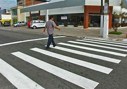
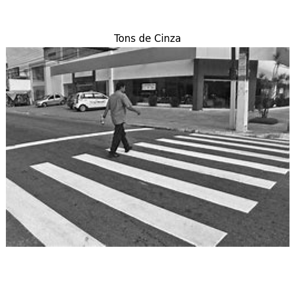
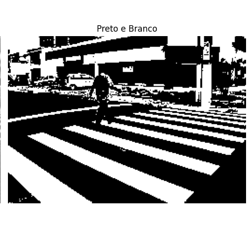

# **Processamento de Imagens: Conversão para Tons de Cinza e Preto e Branco**

Este projeto realiza a conversão de uma imagem para diferentes formatos de visualização: a imagem original, em tons de cinza e em preto e branco. O código é baseado na biblioteca **PIL** (Python Imaging Library) para manipulação de imagens e **Matplotlib** para visualização. As imagens são exibidas lado a lado para facilitar a comparação entre os diferentes processos de transformação.

## **Objetivo**

Este script visa realizar as seguintes transformações sobre uma imagem fornecida:
1. Exibir a imagem original.
2. Converter a imagem para **tons de cinza**.
3. Converter a imagem para **preto e branco** usando um limiar (threshold).
4. Exibir as três versões lado a lado.

## **Requisitos**

Este código requer as seguintes bibliotecas:

- **PIL (Pillow)**: Biblioteca para processamento de imagens em Python.
- **Matplotlib**: Biblioteca para visualização de gráficos e imagens.
- **Numpy** (opcional): Para manipulação avançada de arrays, embora não seja utilizado diretamente no código atual.

### Para instalar as dependências, execute o seguinte comando no terminal:

```bash
pip install pillow matplotlib numpy 
```
## **Como Usar**

1. **Obtenha a imagem**: O código utiliza um caminho local para a imagem. Certifique-se de ter uma imagem em seu diretório de trabalho ou altere a variável `image_path` para apontar para a localização correta.

2. **Substitua o caminho da imagem**: A linha abaixo deve ser ajustada para apontar para a imagem desejada.

    ```python
    image_path = "./image-1.jpg"  # Substitua pelo caminho correto da sua imagem
    ```

3. **Execute o código**: Execute o script em um ambiente Python. O script irá:
    - Carregar e exibir a imagem original.
    - Converter a imagem para tons de cinza.
    - Converter a imagem para preto e branco utilizando um limiar (threshold).
    - Exibir as três imagens lado a lado.

## **Fluxo do Código**

1. **Carregamento da Imagem**: O script carrega a imagem do caminho especificado usando o **Pillow**.

    ```python
    img = Image.open(image_path)
    ```

2. **Exibição da Imagem Original**: A imagem original é exibida com a remoção dos eixos de coordenadas para uma visualização limpa.

    ```python
    plt.imshow(img)
    plt.axis('off')  # Opcional: remove os eixos da imagem
    plt.show()
    ```

3. **Conversão para Tons de Cinza**: A imagem é convertida para tons de cinza com o método `.convert('L')`.

    ```python
    img_gray = img.convert('L')
    ```

4. **Conversão para Preto e Branco**: O código aplica um limiar para a conversão da imagem em uma versão binária (preto e branco). Aqui, a variável `threshold` define o valor de corte:
    - **Pixels com valor maior que 128** são transformados em **branco** (255).
    - **Pixels com valor menor ou igual a 128** são transformados em **preto** (0).

    ```python
    threshold = 128
    img_bw = img_gray.point(lambda p: 255 if p > threshold else 0)
    ```

5. **Exibição das Imagens Lado a Lado**: As imagens são exibidas em uma figura com 3 subgráficos (subplots). Cada subgráfico exibe uma versão diferente da imagem (original, em tons de cinza e em preto e branco).

    ```python
    fig, axs = plt.subplots(1, 3, figsize=(15, 5))  # 1 linha e 3 colunas

    axs[0].imshow(img)
    axs[0].axis('off')
    axs[0].set_title('Original')

    axs[1].imshow(img_gray, cmap='gray')
    axs[1].axis('off')
    axs[1].set_title('Tons de Cinza')

    axs[2].imshow(img_bw, cmap='gray')
    axs[2].axis('off')
    axs[2].set_title('Preto e Branco')

    plt.tight_layout()  # Ajusta o layout para não sobrepor as imagens
    plt.show()
    ```

## **Explicação do Código**

### **Bibliotecas Utilizadas**

- **Pillow (PIL)**:
  - `Image.open(image_path)`: Abre e carrega a imagem do caminho especificado.
  - `.convert('L')`: Converte a imagem para escala de cinza.
  - `.point(lambda p: 255 if p > threshold else 0)`: Aplica o limiar para converter a imagem em preto e branco.

- **Matplotlib**:
  - `plt.imshow(img)`: Exibe uma imagem.
  - `plt.axis('off')`: Remove os eixos para uma visualização limpa.
  - `plt.subplots(1, 3, figsize=(15, 5))`: Cria 1 linha e 3 colunas de subgráficos para exibir as imagens lado a lado.
  - `plt.tight_layout()`: Ajusta o layout para evitar sobreposição.

### **Definição do Threshold**

O limiar (threshold) é definido para 128, o que significa que:
- Valores de pixel maiores que 128 serão convertidos em **branco (255)**.
- Valores de pixel menores ou iguais a 128 serão convertidos em **preto (0)**.

Este valor pode ser ajustado dependendo da imagem que está sendo processada, permitindo maior controle sobre a definição do que é considerado **branco** ou **preto** na imagem binária.

## **Exemplo de Saída**

Ao executar o código, as imagens serão exibidas em um layout com três colunas, como mostrado abaixo:

| Original                       | Tons de Cinza                | Preto e Branco               |
|---------------------------------|------------------------------|------------------------------|
|  |  |  |


As imagens serão dispostas lado a lado para facilitar a comparação entre a versão original, a versão em tons de cinza e a versão binarizada.

## **Considerações Finais**

- Este código pode ser útil para diversos tipos de processamento de imagem, como análise de contornos ou segmentação.
- A conversão para **preto e branco** com limiar é um processo simples e eficaz para criar imagens binárias, com várias aplicações em visão computacional e processamento de imagens.
  
---

**Desenvolvido por**: Samuel Batista  
**Data**: Janeiro de 2025
